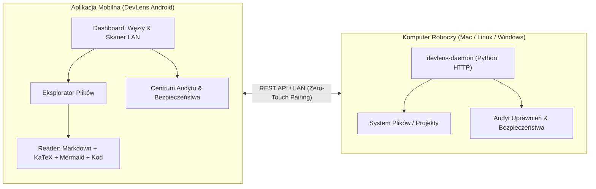

# DevLens 🔍

[](https://github.com/kacperczeczot/devlens/actions/workflows/ci.yml)
[](https://github.com/kacperczeczot/devlens/actions/workflows/release.yml)
[](https://github.com/kacperczeczot/devlens/releases/latest)
[](LICENSE)

**DevLens** to lekka aplikacja mobilna na system Android do zdalnego przeglądania plików, czytania dokumentacji i kodu (Markdown, KaTeX, Mermaid) oraz audytu uprawnień i bezpieczeństwa maszyn deweloperskich w sieci lokalnej (macOS, Linux, Windows).

---

## 🌟 Główne Możliwości

* 📂 **Zdalny Eksplorator Plików & Drzewo Katalogów:**
  * Błyskawiczne przeglądanie projektów na dowolnym komputerze w sieci.
  * Nawigacja po ścieżce (breadcrumbs), sortowanie (nazwa, data, rozmiar), wyszukiwanie i filtrowanie.
  * Pobieranie plików, udostępnianie, wysyłanie (upload) oraz strumieniowanie multimediów.

* 📖 **Zaawansowany Czytnik Dokumentacji i Kodu (DevLens Reader):**
  * **Markdown:** Pełne wsparcie dla nagłówków, tabel, list zadań `[x]`, akordeonów `<details>` i alertów GFM (`[!NOTE]`, `[!TIP]`, `[!WARNING]`, `[!CAUTION]`).
  * **Wzory Matematyczne (KaTeX):** Renderowanie formuł \(\LaTeX\) w tekście i w blokach dedykowanych.
  * **Diagramy Architektury (Mermaid):** Wizualizacja diagramów przepływu (`flowchart`), sekwencji (`sequenceDiagram`), klas i baz danych (`erDiagram`).
  * **Kolorowanie Składni (SyntaxHighlighter):** Obsługa ponad 20 języków programowania (Kotlin, Python, Rust, Go, TypeScript, JavaScript, HTML, CSS, SQL, JSON, YAML itp.).

* 🛡️ **Audytor Uprawnień & Bezpieczeństwa (Security Auditor):**
  * Szybka inspekcja wrażliwych ścieżek (`.ssh`, `.aws`, `.config/gcloud`, `.devlens`).
  * Wykrywanie niebezpiecznych uprawnień do plików i katalogów.
  * Diagnostyka środowiska węzła (wersja OS, procesor, pamięć RAM, stan dysków).

* ⚡ **Lekki Daemon Węzła (Zero Dependencies):**
  * Samodzielny serwer w Pythonie (standardowa biblioteka `http.server`, bez konieczności instalowania zewnętrznych pakietów pip).
  * Bezpieczne parowanie w sieci prywatnej (Zero-Touch LAN Pairing).

* 🔄 **Wbudowany System Aktualizacji:**
  * Automatyczne wykrywanie nowych wersji z GitHub Releases i instalacja APK bezpośrednio w aplikacji.

---

## 🏗️ Architektura



---

## 🚀 Szybki Start

### 1. Uruchomienie Daemona na komputerze

Daemon wymaga jedynie Pythona 3 (bez zewnętrznych bibliotek):

```bash
# Uruchomienie domyślne na porcie 8888:
python3 apps/daemon/server.py

# Lub ze zdefiniowanym portem i własnym tokenem:
python3 apps/daemon/server.py --port 8888 --token mojtajnytoken
```

Serwer wygeneruje token uwierzytelniający i zapisze go w `~/.devlens/nodes.json`.

### 2. Połączenie z telefonu

1. Zainstaluj plik **DevLens.apk** z [sekcji wydań (Releases)](https://github.com/kacperczeczot/devlens/releases/latest).
2. Upewnij się, że telefon i komputer są w tej samej sieci Wi-Fi.
3. Kliknij **„Skanuj i paruj w LAN”** na ekranie głównym aplikacji, aby automatycznie wykryć węzeł, lub dodaj go ręcznie podając IP i token/PIN.

---

## 🛠️ Budowanie Aplikacji ze Źródeł

Wymagany Android SDK oraz JDK 17:

```bash
cd apps/android
./gradlew assembleDebug
```

Wygenerowany plik APK znajdziesz w:
`apps/android/app/build/outputs/apk/debug/app-debug.apk`

---

## 📜 Licencja

Projekt udostępniany jest na warunkach licencji [MIT](LICENSE).
